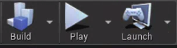

<h1 align="center"><strong>Crossy Road Alpha</strong></h1>

<br />

Check out more about the idea behind this game [here](https://www.crossyroad.com/).

## Getting started

```sh
# 1. Clone this repo
git clone https://github.com/kelseyyim/CrossyRoadAlpha.git

# 2. Open up main project file with Unreal Engine Editor
CrossyRoadAlpha.uproject

# 3 Press Play button and right click on the game screen

```



### Project structure
* 3-D models were created using [MagicaVoxel](https://ephtracy.github.io/)
* Some blueprint logic was inspired by [Unreal Engine 4 Tutorial for Beginners](https://www.raywenderlich.com/771-unreal-engine-4-tutorial-for-beginners-getting-started)

## Contributing

Any feedback would be helpful, please feel free to reach out and share your opinion!
